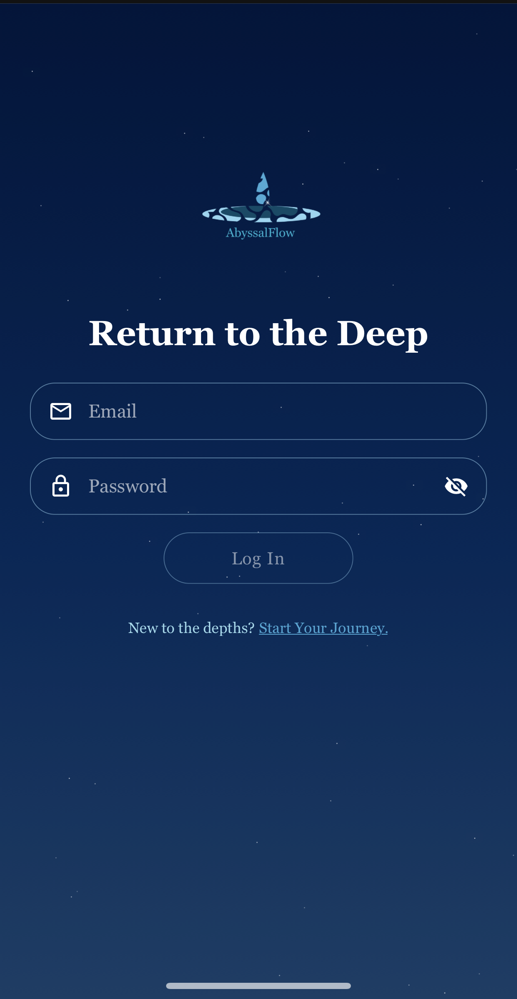
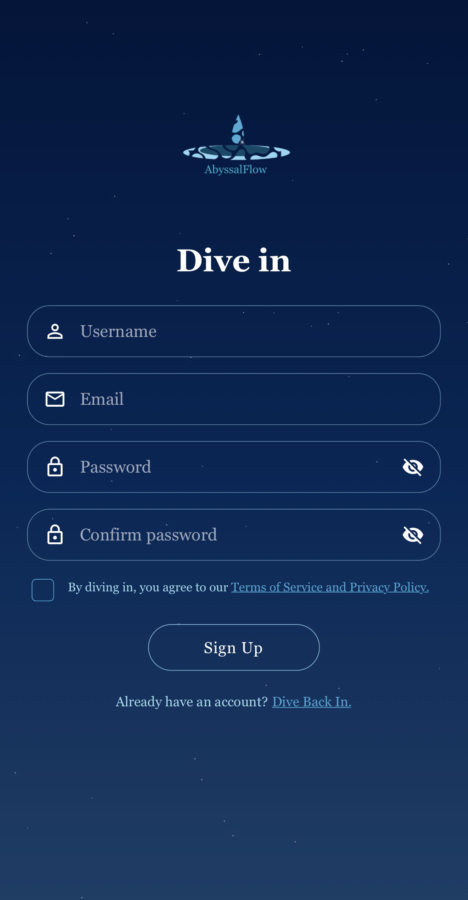
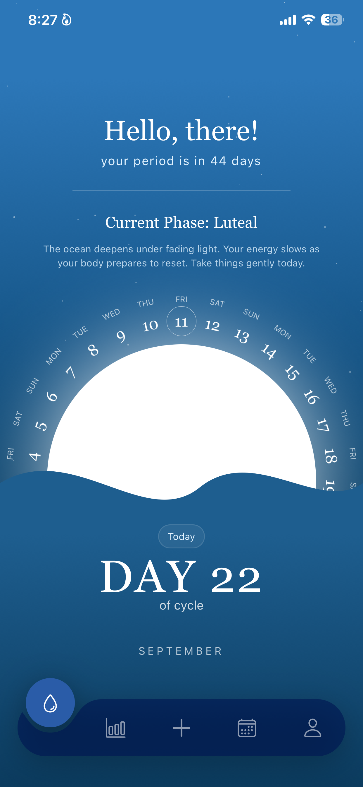
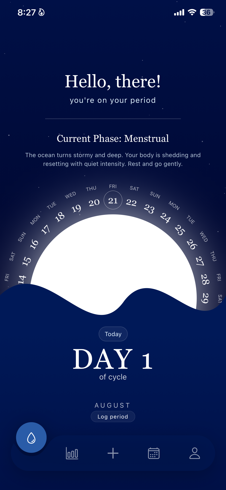
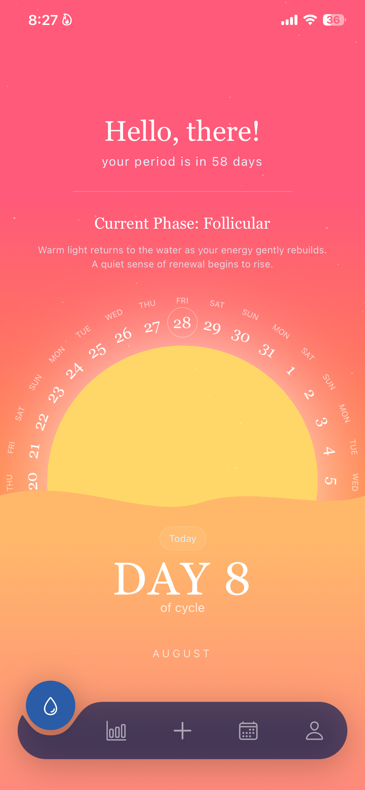
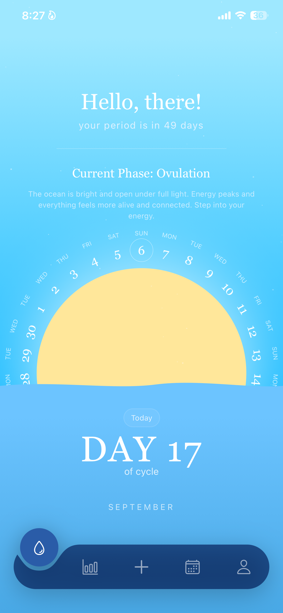
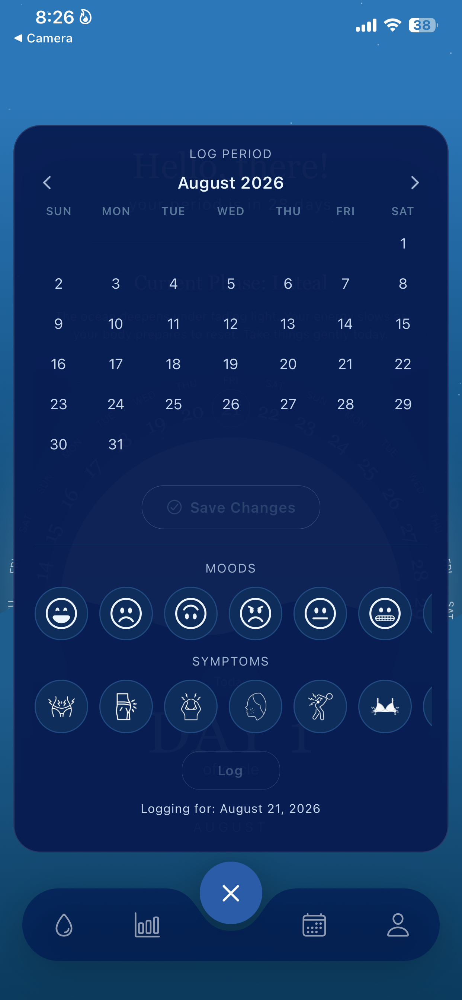
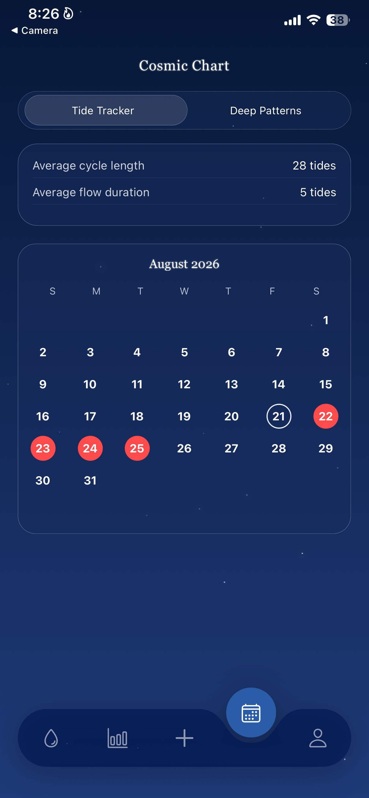
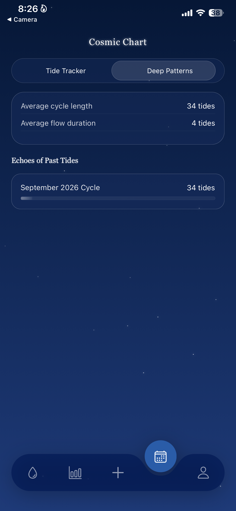
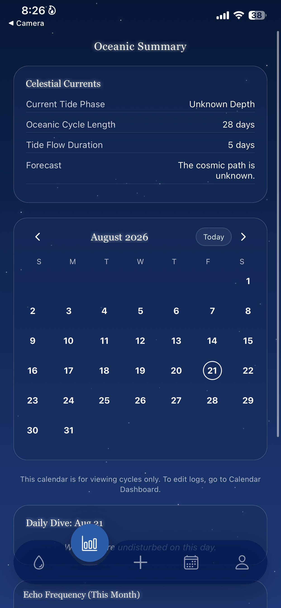

# 🌊 Abyssal Flow

> A soothing, ocean-themed mobile period & menstrual cycle tracker built with **React Native**, **Expo**, and **Supabase**.

Traditional period trackers can often feel clinical, rigid, or overwhelming. **Abyssal Flow** transforms health tracking into a serene, mindful experience by simulating ocean tide states and underwater visual atmospheres that adapt dynamically to the phases of your menstrual cycle.

---

### Authentication & Onboarding
Seamless and secure login and sign-up interfaces wrapped in deep-sea ambient aesthetics.

  
  &nbsp;&nbsp;&nbsp;&nbsp;
  

* **Return to the Deep (Login):** Secure email and password authentication powered by Supabase Auth.
* **Dive In (Sign Up):** Personalized onboarding collecting user account credentials and cycle preferences.

---

### Dynamic Ocean Dashboard & Cycle Phases
The main dashboard visually shifts colors, gradients, and wave animations to reflect your current cycle phase in real time.

  
  &nbsp;
  
  &nbsp;
  
  &nbsp;
  

* 🌑 **Menstrual Phase (Stormy Deep):** Dark navy ocean depths encouraging rest, shedding, and quiet reflection.
* 🌅 **Follicular Phase (Rebuilding Light):** Warm coral and gold gradients representing rising energy and renewal.
* ☀️ **Ovulation Phase (Full Sunlight):** Bright turquoise waters and glowing sunlight marking peak energy levels.
* 🌙 **Luteal Phase (Fading Light):** Deepening azure waters guiding you gently towards cycle reset.

---

### Cycle & Symptom Logging
Take complete control of your cycle data with an intuitive, all-in-one logging modal.

  

* **Interactive Calendar:** Tap dates to easily mark period start and end times.
* **Mood Tracking:** Record emotional states using ocean-themed emoji indicators (Happy, Sad, Neutral, Angry, Grimace, Surprise).
* **Physical Symptom Logging:** Track physical symptoms such as cramps, bloating, acne, fatigue, back pain, and breast tenderness.

---

### Cosmic Chart & Oceanic Analytics
Gain deeper insight into your cycle patterns, historical trends, and future predictions.

  
  &nbsp;
  
  &nbsp;
  

* **Tide Tracker (Calendar View):** Visual monthly calendar highlighting flow days, fertile windows, and expected upcoming cycles.
* **Deep Patterns:** Historical breakdown of cycle history ("Echoes of Past Tides"), average cycle length, and flow duration statistics.
* **Oceanic Summary (Analytics):** High-level health forecast, tide phase summaries, and symptom frequency breakdown.

---

## Tech Stack & Architecture

| Layer | Technologies Used |
| :--- | :--- |
| **Frontend Framework** | [React Native](https://reactnative.dev/) (v0.81.5), [React 19](https://react.dev/) |
| **Tooling & Platform** | [Expo SDK 54](https://expo.dev/), [Expo Router v6](https://docs.expo.dev/router/introduction/) (File-based routing) |
| **Language** | [TypeScript](https://www.typescriptlang.org/) (~5.9) |
| **Backend & Database** | [Supabase](https://supabase.com/) (PostgreSQL, Supabase Auth, Row Level Security, Supabase Storage) |
| **State & Local Storage** | Custom React Context & Hooks (`useCycleData`, `useUser`), `@react-native-async-storage/async-storage`, `expo-secure-store` |
| **Animations & UI** | `react-native-reanimated` (v4), `react-native-gesture-handler`, `expo-linear-gradient`, `react-native-svg` |
| **Device Utilities** | `expo-haptics`, `expo-image-picker`, `expo-status-bar`, `expo-system-ui` |

---

## ✨ Key Features

* **Dynamic Ocean State UI:** Visual atmosphere and theme colors dynamically shift based on cycle phase (Menstrual, Follicular, Ovulation, Luteal).
* **Cycle Prediction & Tracking:** Accurate cycle length calculation, period forecasting, and fertile window estimations.
* **Full CRUD Log Management:** Seamlessly add, edit, or delete period dates, daily moods, and physical symptoms.
* **Deep Pattern Analytics:** Comprehensive historical analytics, average cycle statistics, and symptom trends.
* **Cloud Synchronization:** Secure multi-device data sync with Supabase PostgreSQL and instant local persistence via AsyncStorage.
* **Mindful & Stress-Free Design:** Soothing deep-sea color palette, smooth wave animations, and peaceful UX designed to reduce tracking fatigue.
---

## 📄 License

This project is private and maintained for personal health and mindful cycle tracking.
